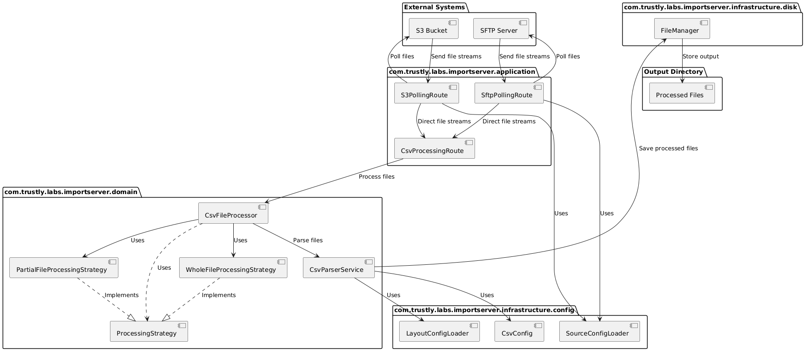
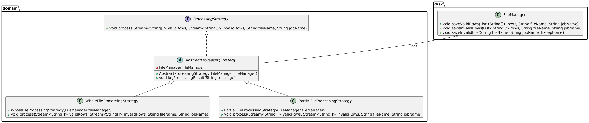

# Import Server

## Overview

The Import Server is a Spring Boot application designed to ingest CSV files from S3 and SFTP sources, validate and process the data, and store the results in an output directory. The application leverages several powerful libraries and frameworks to provide a robust, scalable, and maintainable solution.



## Key Technologies

### Spring Boot
Spring Boot is an open-source Java-based framework used to create stand-alone, production-grade Spring-based applications. It simplifies the development process by providing a convention over configuration approach, allowing developers to focus on the application's functionality rather than boilerplate code.

### Lombok
Lombok is a Java library that automatically plugs into your editor and build tools, spicing up your Java. It helps reduce boilerplate code by generating commonly used methods such as getters, setters, equals, hashCode, and toString, as well as constructors and loggers.

### SLF4J
The Simple Logging Facade for Java (SLF4J) serves as a simple facade or abstraction for various logging frameworks, such as java.util.logging, logback, and log4j. It allows the end-user to plug in the desired logging framework at deployment time.

### OpenCSV
OpenCSV is a CSV parser library for Java. It provides a simple and flexible way to read and write CSV files, making it an ideal choice for processing CSV data in the application.

### Apache Camel
Apache Camel is an open-source integration framework designed to make integrating systems easier. It provides a wide range of components to connect to various systems, including S3 and SFTP, and supports complex routing and mediation rules.

## Project Structure

```
import-server/
├── pom.xml
├── lombok.config
├── README.md
├── src
│   ├── main
│   │   ├── java
│   │   │   └── com
│   │   │       └── trustly
│   │   │           └── importserver
│   │   │               ├── infrastructure
│   │   │               │   ├── config
│   │   │               │   │   ├── CsvConfig.java
│   │   │               │   │   ├── LayoutConfigLoader.java
│   │   │               │   │   ├── SourceConfigLoader.java
│   │   │               │   ├── disk
│   │   │               │   │   ├── FileManager.java
│   │   │               ├── application
│   │   │               │   ├── CsvProcessingRoute.java
│   │   │               │   ├── S3PollingRoute.java
│   │   │               │   ├── SftpPollingRoute.java
│   │   │               ├── domain
│   │   │               │   ├── CsvParserService.java
│   │   │               │   ├── CsvFileProcessor.java
│   │   │               │   ├── ProcessingStrategy.java
│   │   │               │   ├── WholeFileProcessingStrategy.java
│   │   │               │   ├── PartialFileProcessingStrategy.java
│   │   │               ├── ImportServerApplication.java
│   │   ├── resources
│   │   │   ├── application.yml
│   │   │   ├── layouts.yml
│   │   │   ├── sources.yml
│   ├── test
│       ├── java
│       │   └── com
│       │       └── trustly
│       │           └── importserver
│       ├── resources
```

## Configuration

### `application.yml`

The `application.yml` file contains the application-specific configurations.

```yaml
csv:
  outputDirectory: ${CSV_OUTPUT_DIRECTORY:/output}
```

### `sources.yml`

The `sources.yml` file contains the CSV sources configuration.

```yaml
csv:
  sources:
    s3:
      - bucketName: ${CSV_S3_BUCKET_NAME_1:bucket-name-1}
        layout: "layout1"
        prefix: ${CSV_S3_PREFIX_1:prefix1/}
        cron: ${CSV_S3_CRON_1:0 0/5 * * * ?}
        enabled: ${CSV_S3_ENABLED_1:true}
      - bucketName: ${CSV_S3_BUCKET_NAME_2:bucket-name-2}
        layout: "layout2"
        prefix: ${CSV_S3_PREFIX_2:prefix2/}
        cron: ${CSV_S3_CRON_2:0 0 * * * ?}
        enabled: ${CSV_S3_ENABLED_2:true}
    sftp:
      - host: ${CSV_SFTP_HOST_1:sftp-host-1}
        port: ${CSV_SFTP_PORT_1:22}
        user: ${CSV_SFTP_USER_1:user1}
        password: ${CSV_SFTP_PASSWORD_1:password1}
        path: ${CSV_SFTP_PATH_1:/path1}
        layout: "layout1"
        cron: ${CSV_SFTP_CRON_1:0 0/10 * * * ?}
        enabled: ${CSV_SFTP_ENABLED_1:true}
      - host: ${CSV_SFTP_HOST_2:sftp-host-2}
        port: ${CSV_SFTP_PORT_2:22}
        user: ${CSV_SFTP_USER_2:user2}
        password: ${CSV_SFTP_PASSWORD_2:password2}
        path: ${CSV_SFTP_PATH_2:/path2}
        layout: "layout2"
        cron: ${CSV_SFTP_CRON_2:0 0 * * * ?}
        enabled: ${CSV_SFTP_ENABLED_2:true}
```

### `layouts.yml`

The `layouts.yml` file defines the layouts for the CSV files, including the columns, data types, validation rules, and whether the file has a header.

```yaml
layouts:
  layout1:
    hasHeader: true
    processWholeFile: true
    columns:
      - name: "Name"
        type: "string"
        mandatory: true
        nullable: false
      - name: "Age"
        type: "integer"
        mandatory: false
        nullable: true
        regex: "^[0-9]+$"
      - name: "Email"
        type: "string"
        mandatory: true
        nullable: false
        regex: "^[A-Za-z0-9+_.-]+@(.+)$"
      - name: "Role"
        type: "string"
        mandatory: false
        nullable: true
        enumValues: ["ADMIN", "USER", "GUEST"]
  layout2:
    hasHeader: false
    processWholeFile: false
    columns:
      - name: "Product"
        type: "string"
        mandatory: true
        nullable: false
      - name: "Price"
        type: "double"
        mandatory: true
        nullable: false
      - name: "Quantity"
        type: "integer"
        mandatory: true
        nullable: false
```

## How It Works

### Processing CSV Files

1. **Polling Routes:** 
   - Camel routes are configured to poll S3 and SFTP sources based on cron expressions.
   - When a new file is detected, the file is sent to the `direct:processCsvFile` route for processing.

2. **File Processing:** 
   - The `CsvFileProcessor` reads the file content and passes it to the `CsvParserService` for parsing.
   - The `CsvParserService` uses OpenCSV to read the CSV file and validate the rows based on the layout configuration defined in `layouts.yml`.

3. **Processing Strategy:** 
   - The `CsvParserService` utilizes a `ProcessingStrategy` to determine how to handle the rows. There are two implementations:
     - `WholeFileProcessingStrategy`: Processes the entire file. If any row is invalid, the whole file is rejected.
     - `PartialFileProcessingStrategy`: Processes valid rows individually, saving invalid rows separately.

     


4. **Error Handling:** 
   - Invalid rows are saved in a separate file.
   - Logs indicate if files or rows were ignored.

5. **Output:** 
   - The output files are saved in the configured output directory.

### PlantUML Diagrams

* High-Level Architecture [here](docs/plantuml/high-level-architecture.puml)
* ProcessingStrategy Implementation [here](docs/plantuml/processing-strategy.puml)

